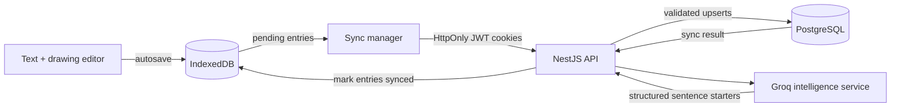

# Outdoor Reflections

> A quiet, offline-first journal for capturing time outdoors in words and sketches.

Outdoor Reflections combines a block-based writing space with a pressure-aware drawing canvas. Entries are saved locally first, remain available without a connection, and can be synchronized to an authenticated account when the network returns.

This repository contains the first working version of the idea: **v0.1**. It is an active, local-development release rather than a production deployment, but the core editor, persistence, sync, authentication, and AI foundations are in place.


## v0.1 technical highlights

| Highlight | What makes it interesting |
| --- | --- |
| **Local-first persistence** | IndexedDB is the immediate source of truth. Writing and drawing do not wait for the API, and every database connection is closed after its transaction so upgrades and DevTools operations are not left blocked. |
| **Conflict-aware synchronization** | Entries carry `createdAt`, `lastEditedAt`, and sync state. The API validates each reflection, enforces ownership, creates missing records, and only applies an update when the browser copy is newer. |
| **One mixed-media document** | Ordered text blocks and freehand SVG paths live in the same reflection model, so autosave and synchronization preserve the complete journal page rather than treating sketches as attachments. |
| **Purpose-built drawing engine** | Pointer position and pressure are transformed into smooth, scalable SVG paths with `perfect-freehand`; strokes retain their colour and stay resolution independent. |
| **Stateful, cookie-based authentication** | Local credentials and Google OAuth feed into short-lived access JWTs and refresh sessions. Refresh tokens are stored as hashes, delivered through `HttpOnly` cookies, and checked to prevent duplicate active sessions on a device. |
| **AI with constrained output** | A Groq-backed intelligence service uses recent writing as context and structured JSON output to return three short sentence starters without inventing memories or writing the entry for the user. |
| **Tests across real boundaries** | Unit, integration, repository, and end-to-end tests cover validation, PostgreSQL persistence, token refresh, cookie behaviour, duplicate sessions, sync outcomes, and service teardown. The current backend suite contains **48 passing tests**. |

## What the first version can do

- Create reflections containing a title, date, reorderable writing blocks, and drawings.
- Draw with pointer pressure and undo or redo strokes.
- Autosave edits to IndexedDB after input settles.
- Browse locally stored entries, including while offline or signed out.
- Mark edited entries as pending and synchronize them in the background.
- Retry synchronization after refreshing an expired access token.
- Register and sign in with email/password or a Google account.
- Recover a local account through a time-limited emailed reset link.
- Generate contextual sentence starters through the backend intelligence endpoint.

## How the pieces fit together



The browser copy is deliberately written first. After one second of inactivity the editor saves a pending reflection locally; after a longer quiet period—or when connectivity changes—the sync flow sends pending entries belonging to the current user. The server returns per-request counts and a `SUCCESS`, `PARTIAL`, or `FAILED` result, and confirmed local entries are marked as synced.

## Engineering decisions

### Offline before accounts

The editor works without making authentication or network availability a prerequisite for writing. IndexedDB keeps local and account-owned entries on the device, while `userId` prevents one signed-in user from seeing or synchronizing another user's local entries.

### Drawings as data

Each stroke is stored as path data plus its colour. This keeps a reflection portable across IndexedDB, JSON requests, and PostgreSQL without rasterizing the page or losing drawing quality.

### Sessions that can be invalidated

An access token is intentionally short lived. Its companion refresh token includes a server-side session ID, and only a bcrypt hash is persisted. The server can therefore validate the browser cookie without storing the credential itself.

### Suggestions, not generated memories

The intelligence layer is designed to help someone continue writing in their own voice. Its prompt limits output to short sentence starters, supplies earlier entries only as thematic context, and requests a defined JSON schema rather than accepting unstructured model text.

## Stack

| Layer | Technology |
| --- | --- |
| Web application | Next.js 16, React 19, TypeScript |
| UI and motion | Tailwind CSS 4, Motion, Radix UI |
| Drawing | perfect-freehand, SVG |
| Browser persistence | IndexedDB |
| API | NestJS 11, Passport, Zod |
| Data | PostgreSQL 17, Prisma 7 |
| Authentication | Local strategy, Google OAuth, JWT, bcrypt, HttpOnly cookies |
| Intelligence | Groq SDK, `openai/gpt-oss-20b`, structured output |
| Testing | Jest, Supertest, Nest testing utilities, Vitest, Testing Library |

## Repository map

```text
outdoor-reflections/
├── frontend/                 Next.js application
│   ├── app/                  Routes and layouts
│   ├── components/           Editor, canvas, entry list, auth and sync UI
│   ├── lib/database.ts       IndexedDB persistence boundary
│   └── lib/context/          Authentication and client sync orchestration
└── backend/                  NestJS application
    ├── prisma/               PostgreSQL schema and migrations
    └── src/
        ├── auth/             Local/OAuth login, JWT sessions and password reset
        ├── reflections/      Persistence, synchronization and intelligence
        ├── mail/             Password-reset delivery
        └── database/         Prisma lifecycle and test helpers
```

Good starting points for exploring the implementation:

- [`EntryEditor.tsx`](frontend/components/EntryEditor.tsx) — autosave, sync timing, editor modes, and drawing history.
- [`DrawingArea.tsx`](frontend/components/DrawingArea.tsx) — pointer-to-SVG freehand rendering.
- [`database.ts`](frontend/lib/database.ts) — the IndexedDB transaction wrapper.
- [`authContext.tsx`](frontend/lib/context/authContext.tsx) — browser authentication and pending-entry sync.
- [`sync.service.ts`](backend/src/reflections/sync.service.ts) — sync reporting and orchestration.
- [`reflections.repository.ts`](backend/src/reflections/reflections.repository.ts) — validation, ownership, and timestamp reconciliation.
- [`auth.service.ts`](backend/src/auth/auth.service.ts) — refresh sessions, token hashing, OAuth users, and password reset.
- [`auth.service.integration.spec.ts`](backend/src/auth/auth.service.integration.spec.ts) — real persistence and token-flow coverage.

## v0.1 status

This release proves the central interaction: a reflection can begin offline as text and drawing, survive locally, and later become authenticated server data without interrupting the writing experience. The next iterations can build on that foundation with richer conflict resolution, surfaced AI suggestions in the editor, broader offline/PWA support, and production deployment hardening.
