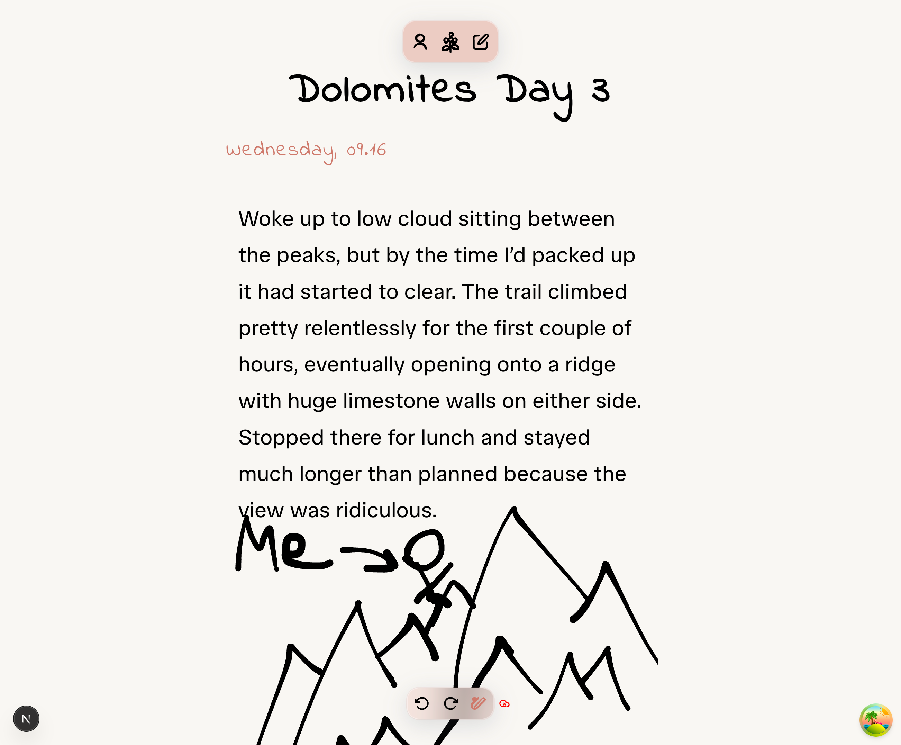
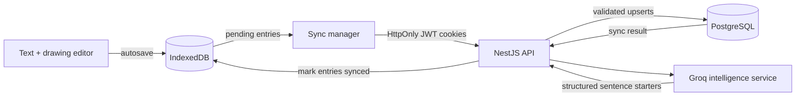

# Outdoor Reflections

> A quiet, offline-first journal for capturing time outdoors in words and sketches.

Outdoor Reflections combines a block-based writing space with a pressure-aware drawing canvas. Entries are saved locally first, remain available without a connection, and can be synchronized to an authenticated account when the network returns.

This repository contains **v0.1**, the first deployed release of Outdoor Reflections. It delivers the core editor, offline persistence, synchronization, authentication and AI foundations as a working full-stack product.

**Live app:** [outdoor-reflections.vercel.app](https://outdoor-reflections.vercel.app)



## Technical highlights

### Frontend engineering

- **Offline-first editing** — mixed text and drawing entries are written to IndexedDB after one second of inactivity, keeping the journal usable without a server or network connection.
- **Pressure-aware SVG drawing** — browser pointer pressure is converted into smooth `perfect-freehand` strokes, while inverse SVG coordinate transforms keep input accurate as the editor scales.
- **Responsive mixed-media workspace** — a `ResizeObserver` scales the fixed drawing coordinate system across mobile and desktop without distorting saved paths.
- **Touch-friendly block editing** — writing is split into reorderable blocks with animated drag constraints and 150 ms long-press detection for deliberate movement on touchscreens.
- **Resilient background sync** — the client tracks pending entries per user, reacts to connectivity changes, refreshes expired sessions and retries interrupted requests automatically.
- **Guest-to-account continuity** — locally created entries can be claimed by a signed-in account and queued for synchronization without losing the user's existing work.
- **Custom visual system** — the icon renderer samples each SVG path at roughly 100 positions, rebuilds it as a tapered freehand stroke and animates individual path segments for a consistent hand-drawn style.

### Backend engineering

- **Transactional synchronization** — the NestJS API validates every reflection, enforces ownership and compares edit timestamps so older offline data cannot overwrite newer server records.
- **Partial-failure reporting** — each sync returns created, updated and failed counts, per-entry errors, execution time and a `SUCCESS`, `PARTIAL` or `FAILED` result instead of discarding an entire batch.
- **Stateful authentication** — email/password and Google OAuth use 10-minute access tokens, seven-day refresh sessions, bcrypt-hashed refresh tokens and secure `HttpOnly` cookies.
- **Revocable session model** — refresh tokens are linked to server-side UUID sessions, allowing validation without storing the raw credential and preventing duplicate active logins on one device.
- **Password recovery by design** — 15-minute reset tokens are derived from the user's current password, so a successful password change automatically invalidates previously issued links; generic responses also reduce account-enumeration risk.
- **Constrained AI output** — Groq structured responses produce exactly three sentence starters under 20 words, using earlier writing for themes while explicitly avoiding invented memories and copied content.
- **Tests across real boundaries** — 48 passing tests across 12 unit, integration, repository and end-to-end suites cover PostgreSQL transactions, cookies, token refresh, OAuth callbacks, validation and partial sync failures.

## What the first version can do

- Create reflections containing a title, date, reorderable writing blocks, and drawings.
- Draw with pointer pressure and undo or redo strokes.
- Autosave edits to IndexedDB after input settles.
- Browse locally stored entries, including while offline or signed out.
- Mark edited entries as pending and synchronize them in the background.
- Retry synchronization after refreshing an expired access token.
- Register and sign in with email/password or a Google account.
- Recover a local account through a time-limited emailed reset link.
- Generate contextual sentence starters through the backend intelligence endpoint.

## How the pieces fit together



The browser copy is deliberately written first. After one second of inactivity the editor saves a pending reflection locally; after a longer quiet period—or when connectivity changes—the sync flow sends pending entries belonging to the current user. The server returns per-request counts and a `SUCCESS`, `PARTIAL`, or `FAILED` result, and confirmed local entries are marked as synced.

## Key engineering decisions

### Offline before accounts

Writing should not depend on authentication or network availability. IndexedDB is therefore the immediate source of truth, while `userId` separates guest and account-owned entries on the device. The browser can later move guest entries into an account and synchronize them without changing the editing experience.

### Drawings as application data

Each stroke is stored as SVG path data plus its colour rather than as a raster image. A complete reflection—text, ordering and artwork—can therefore move through IndexedDB, JSON requests and PostgreSQL without losing drawing quality.

### The newest valid edit wins

Synchronization is more than a blind upsert. The API validates each payload, checks that an existing reflection belongs to the requesting user and compares `lastEditedAt` before applying an update. Mixed outcomes remain visible to the client through structured partial-success responses.

### Sessions remain verifiable and revocable

Access tokens are intentionally short lived. Each refresh token contains a server-side session ID, but only its bcrypt hash is persisted. The API can verify a browser session without storing the usable credential itself.

### Suggestions, not generated memories

The intelligence layer helps someone continue in their own voice rather than writing a journal entry for them. Previous entries are supplied only as thematic context, and a JSON schema constrains the model to short sentence starters.

## Stack

| Layer | Technology |
| --- | --- |
| Web application | Next.js 16, React 19, TypeScript |
| UI and motion | Tailwind CSS 4, Motion, Radix UI |
| Drawing | perfect-freehand, SVG |
| Browser persistence | IndexedDB |
| API | NestJS 11, Passport, Zod |
| Data | PostgreSQL 17, Prisma 7 |
| Authentication | Local strategy, Google OAuth, JWT, bcrypt, HttpOnly cookies |
| Intelligence | Groq SDK, `openai/gpt-oss-20b`, structured output |
| Testing | Jest, Supertest, Nest testing utilities, Vitest, Testing Library |

## Repository map

```text
outdoor-reflections/
├── frontend/                 Next.js application
│   ├── app/                  Routes and layouts
│   ├── components/           Editor, canvas, entry list, auth and sync UI
│   ├── lib/database.ts       IndexedDB persistence boundary
│   └── lib/context/          Authentication and client sync orchestration
└── backend/                  NestJS application
    ├── prisma/               PostgreSQL schema and migrations
    └── src/
        ├── auth/             Local/OAuth login, JWT sessions and password reset
        ├── reflections/      Persistence, synchronization and intelligence
        ├── mail/             Password-reset delivery
        └── database/         Prisma lifecycle and test helpers
```

Good starting points for exploring the implementation:

- [`EntryEditor.tsx`](frontend/components/EntryEditor.tsx) — autosave, sync timing, editor modes, and drawing history.
- [`DrawingArea.tsx`](frontend/components/DrawingArea.tsx) — pointer-to-SVG freehand rendering.
- [`database.ts`](frontend/lib/database.ts) — the IndexedDB transaction wrapper.
- [`authContext.tsx`](frontend/lib/context/authContext.tsx) — browser authentication and pending-entry sync.
- [`sync.service.ts`](backend/src/reflections/sync.service.ts) — sync reporting and orchestration.
- [`reflections.repository.ts`](backend/src/reflections/reflections.repository.ts) — validation, ownership, and timestamp reconciliation.
- [`auth.service.ts`](backend/src/auth/auth.service.ts) — refresh sessions, token hashing, OAuth users, and password reset.
- [`auth.service.integration.spec.ts`](backend/src/auth/auth.service.integration.spec.ts) — real persistence and token-flow coverage.

## v0.1 status

This deployed release proves the central interaction: a reflection can begin offline as text and drawing, survive locally, and later become authenticated server data without interrupting the writing experience. Future iterations can build on that production foundation with richer conflict resolution, AI suggestions surfaced directly in the editor, broader PWA support, and deeper operational monitoring.

## Future improvements

- Integrate the existing Groq-powered sentence-starter service into the deployed editor experience.
- Allow users to delete reflections locally and synchronize deletions with their account.
- Add drag-and-drop photo uploads so reflections can combine writing, drawings and photography.

## Known issues

- Text blocks can shift or bounce while their content is being edited.
- The drawing tool does not currently work in Safari.
